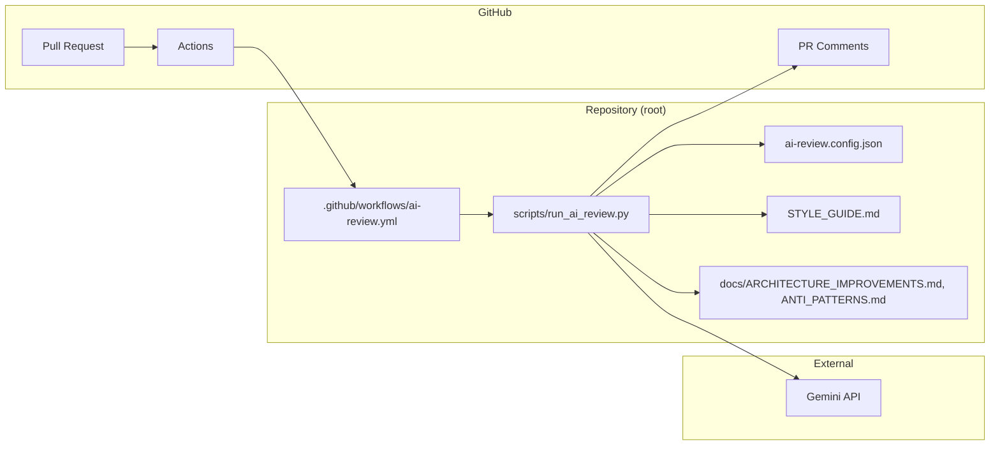
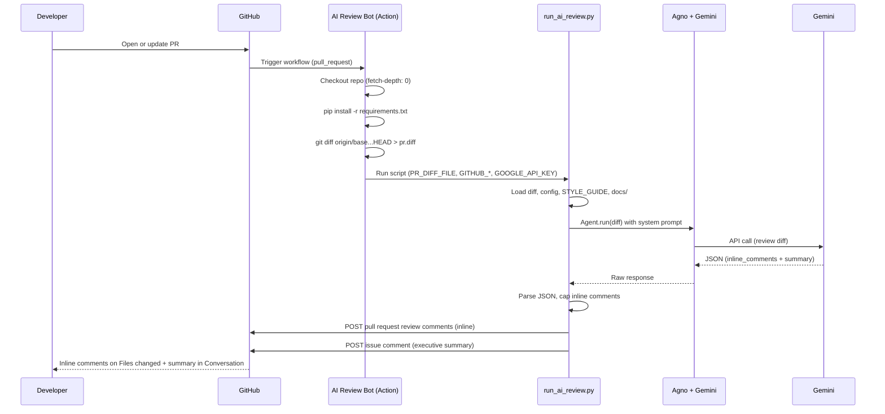
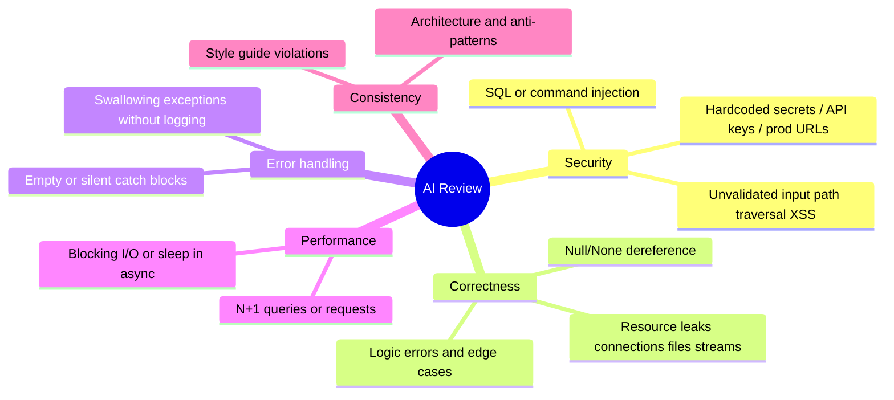

# AI-Review-Bot — Automated Code Review for Pull Requests

This document describes the **AI-Review-Bot**: an automated, agentic code review layer that runs in GitHub Actions on every Pull Request. It uses the [Agno](https://agno.com) framework with **Gemini** to provide inline comments and an executive summary, aligned with your repository’s style guide and anti-patterns.

**In this repo**, the bot lives at the repository root: `.github/workflows/ai-review.yml`, `scripts/run_ai_review.py`, `requirements.txt`, `STYLE_GUIDE.md`, and `docs/`. The folder `ai-review-bot-validation/` contains sample code for validation and demos.

---

## Table of contents

- [Executive summary](#executive-summary)
- [Architecture overview](#architecture-overview)
- [End-to-end flow](#end-to-end-flow)
- [What the bot checks](#what-the-bot-checks)
- [Demo files (expected review comments)](#demo-files-expected-review-comments)
- [How to validate the flow](#how-to-validate-the-flow)
- [Project layout](#project-layout)
- [Configuration](#configuration)
- [Local run](#local-run)
- [Requirements](#requirements)
- [Troubleshooting](#troubleshooting)
- [Validation checklist](#validation-checklist)

---

## Executive summary

| Aspect | Description |
|--------|-------------|
| **Trigger** | `pull_request` (opened, synchronize, reopened) → GitHub Action runs. |
| **Context** | Full checkout + `git diff` of the PR (base ref...HEAD). |
| **Brain** | Agno Agent with a **Senior Engineer** persona + repository knowledge: `STYLE_GUIDE.md`, `docs/ARCHITECTURE_IMPROVEMENTS.md`, `docs/ANTI_PATTERNS.md`. |
| **Model** | Gemini (default: `gemini-2.5-flash`; configurable via `ai-review.config.json` or `GEMINI_MODEL`). |
| **Output** | **Inline comments** on the diff (file + line) + **one executive summary comment** on the PR (grades + Required changes + Good to have). |

Inline comments are reserved for **required** (must-fix) findings by default; optional improvements are listed only in the summary. This keeps PRs readable and actionable.

---

## Architecture overview

The following diagram shows the main components and where they live.



**Component roles:**

- **Workflow** (`ai-review.yml`): Checkout, generate PR diff, set env vars, run the Python script.
- **Script** (`run_ai_review.py`): Load diff + config + repo context (style, architecture, anti-patterns), call Agno agent with Gemini, parse JSON response, post inline comments and summary to the PR.
- **Config** (`ai-review.config.json`): Optional; caps inline comments, summary grades, custom instructions, model id.
- **Context docs**: Injected into the agent prompt so reviews align with your standards.

---

## End-to-end flow

Sequence from “PR opened/updated” to “comments on PR”.



---

## What the bot checks

The agent is instructed to consider the following dimensions for **every** diff. Violations are classified as **Required** (must-fix) or **Good to have** (optional); only required/critical items are posted as inline comments by default.



| Dimension | Examples of what is flagged |
|-----------|-----------------------------|
| **Security** | Hardcoded secrets/API keys; user input concatenated into SQL or shell commands; path traversal; unvalidated input in responses or file paths. |
| **Correctness** | Possible null/None dereference; wrong conditions or missing edge cases; connections/handles/streams not closed in `finally` or try-with-resources. |
| **Error handling** | Empty `catch`/`except`; exceptions swallowed without logging or re-raise. |
| **Performance** | N+1 (one query/request per loop item); blocking I/O or `sleep` in async code. |
| **Consistency** | Violations of `STYLE_GUIDE.md`, `docs/ARCHITECTURE_IMPROVEMENTS.md`, and `docs/ANTI_PATTERNS.md`. |

Repository-specific rules are in:

- **`STYLE_GUIDE.md`** (root): Naming, types, security, performance, testing.
- **`docs/ARCHITECTURE_IMPROVEMENTS.md`**: Structure, data access, config, logging.
- **`docs/ANTI_PATTERNS.md`**: Concrete anti-patterns (secrets, injection, leaks, empty catch, N+1, etc.).

---

## Demo files (expected review comments)

The **`ai-review-bot-validation/review/`** folder contains **intentionally flawed** sample code so you can open a PR and see the bot’s inline comments and summary in action. Use these to validate the pipeline and to show teammates what to expect.

| File | Purpose | Issues the bot should flag (examples) |
|------|---------|--------------------------------------|
| **`UserProfileDataService.java`** | Data access and user operations. | Hardcoded DB URL and credentials; API key in source; SQL concatenation (injection); path traversal in `loadProfilePicture`; empty/silent catch blocks; N+1 in `getNamesForIds`; **NPE** (`name.trim()`, `addr.getLine1()` when null); **SQL performance** (`findActiveUserEmails`: SELECT *, UPPER on column); **missing tests** (`getUserDisplayName`). |
| **`export_webhook_handler.py`** | HTTP API and shell/export. | Hardcoded API key; command injection via user input in shell; empty `except`; file handle not closed on error path; missing type hints at boundaries. |
| **`OrderFulfillmentService.java`** | Orders and idempotency. | Resource leak; logic bug (wrong comparison); broad `catch` with no logging; **NPE** (`getOrderStatusLower`: .toLowerCase() on null); **SQL performance** (`getOrderStatus`: SELECT * for one column); **missing tests** (`isOrderFulfillable`). |
| **`report_generator_service.rb`** | Rails-style report generation. | Hardcoded API key and prod webhook URL; SQL injection; path traversal; bare `rescue`; N+1 in `generate_user_report`; **loop not closed**: `concat_export_contents` opens `File` in loop but never closes; **SQL performance** (`active_users_slow`: SELECT *, LOWER on column). |
| **`PaymentsDataAccess.scala`** | Payment data access. | Hardcoded JDBC URL and credentials; SQL injection; resource leak in `findByTransactionId` and `updateStatus`; empty catch; **SQL performance** (`allStatuses`: SELECT * when only status needed). |
| **`schema.graphql`** | GraphQL API schema. | Sensitive fields exposed on `User` (`password`, `apiToken`); unbounded lists `users`/`orders` with no pagination (DoS/overfetch risk); inconsistent naming (`created_at` vs camelCase convention). |

When you add or change these files in a branch and open a PR, the bot will post inline comments on the problematic lines and an executive summary with grades (e.g. Consistency, Quality, Security) plus “Required changes” and “Good to have” bullets.

---

## How to validate the flow

### 1. Push this repo to GitHub

```bash
git init
git add .
git commit -m "Initial AI-Review-Bot validation project"
git remote add origin https://github.com/YOUR_ORG/ai-review-bot-validation.git
git push -u origin main
```

### 2. Configure secrets

In **Settings → Secrets and variables → Actions**, add:

| Secret | Description |
|--------|-------------|
| `GOOGLE_API_KEY` | Google AI / Gemini API key ([create one](https://aistudio.google.com/apikey)). |
| `GITHUB_TOKEN` | Usually provided by the workflow; for custom bots you may add a PAT with `repo` scope. |

The workflow uses the built-in `GITHUB_TOKEN` with `pull-requests: write` so it can post comments.

### 3. Open a Pull Request

- Create a branch: `git checkout -b feature/sample-change`
- Use or modify files in `ai-review-bot-validation/review/` (e.g. add the demo files, or make a small change).
- Push and open a PR against `main`.

### 4. Verify

1. **Actions**: In the PR, open the **Actions** tab; workflow **AI Review Bot** should run.
2. **Inline comments**: In **Files changed**, check for inline comments on the lines the bot flagged.
3. **Summary**: In **Conversation**, find the bot’s comment with the executive summary (grades + Required changes + Good to have).

---

## Project layout

| Location | Contents |
|----------|----------|
| **Repository root** | `.github/workflows/ai-review.yml`, `scripts/run_ai_review.py`, `requirements.txt`, `STYLE_GUIDE.md`, `docs/`, `ai-review.config.json` (optional), `ai-review.config.example.json` (all options), `README.md` (this file). |
| **`ai-review-bot-validation/review/`** | Sample/demo code for bot validation (no README in that folder; docs are here at root). |

---

## Configuration

Admins can tune the bot per repo by editing **`ai-review.config.json`** at the repository root. Omit the file to use defaults.

**To see all options in one place:** copy **`ai-review.config.example.json`** to `ai-review.config.json` and edit, or use the table below.

| Key | Default | Description |
|-----|---------|-------------|
| `max_inline_comments` | `5` | Maximum number of inline comments to post on the PR. |
| `allow_good_to_have_inline` | `false` | If `true`, the bot may post some “good to have” suggestions as inline comments. |
| `post_inline_comments` | `true` | If `false`, only the executive summary is posted; no inline comments on the diff. |
| `diff_max_lines` | `0` | If > 0, the diff is truncated to this many lines before sending to the model (avoids token limits). `0` = no truncation. |
| `summary_grades` | `["Consistency", "Quality", "Security"]` | Dimensions to grade in the executive summary (e.g. add `"Performance"`, `"Tests"`). |
| `max_required_in_summary` | `3` | Max bullets for “Required changes” in the summary. |
| `max_good_to_have_in_summary` | `3` | Max bullets for “Good to have” in the summary. |
| `required_description` | *(in script)* | Short description of what counts as “required” (injected into the prompt). |
| `good_to_have_description` | *(in script)* | Short description of what counts as “good to have”. |
| `custom_instructions` | `""` | Optional extra instructions appended to the prompt (project-specific). |
| `model` | `""` | Gemini model id (e.g. `gemini-2.5-flash`). Empty = use env `GEMINI_MODEL` or default. |

Example for a stricter project:

```json
{
  "max_inline_comments": 3,
  "allow_good_to_have_inline": false,
  "summary_grades": ["Consistency", "Quality", "Security", "Tests"],
  "max_required_in_summary": 5,
  "max_good_to_have_in_summary": 3,
  "custom_instructions": "Focus on security and dependency hygiene. Flag any new external API calls."
}
```

---

## Local run

You can run the reviewer locally without posting to GitHub (dry-run):

From the **repository root**:

```bash
python -m venv .venv
source .venv/bin/activate   # or .venv\Scripts\activate on Windows
pip install -r requirements.txt
export GOOGLE_API_KEY=your_key
git diff main...HEAD > /tmp/pr.diff
PR_DIFF_FILE=/tmp/pr.diff python scripts/run_ai_review.py --dry-run
```

Output: inline comments and summary printed to stdout; nothing is posted to the PR.

---

## Requirements

- Python 3.10+
- Dependencies: `agno[google]`, `requests` (see `requirements.txt`).

---

## Troubleshooting

**Why are no review comments appearing?**

1. **Workflow in this repo**  
   The bot runs only when `.github/workflows/ai-review.yml` is in the same repo as the PR. Here, the workflow and `scripts/run_ai_review.py` live at the repository root.

2. **GOOGLE_API_KEY**  
   In the PR’s **Actions** tab, open the “AI Review Bot” run. If you see `GOOGLE_API_KEY is not set`, add the secret in **Settings → Secrets and variables → Actions** and re-run the workflow (or push a new commit).

3. **Workflow ran from the PR branch**  
   The job runs on the branch that has the PR. That branch must contain `.github/workflows/ai-review.yml`, `scripts/run_ai_review.py`, and `requirements.txt`. If the workflow was only added on `main` after the PR was opened, push a commit to the PR branch or re-run the workflow.

4. **GitHub Enterprise**  
   The script uses `GITHUB_API_URL` (from `github.server_url` in the workflow). If you use a different API base, set `GITHUB_API_URL` in the workflow env.

---

## Validation checklist

After pushing and opening a PR, confirm:

- [ ] Workflow **AI Review Bot** appears under the Actions tab and runs on the PR.
- [ ] No workflow failure due to missing `GOOGLE_API_KEY` (add the secret if you want the bot to run).
- [ ] When the secret is set: a new **comment** appears on the PR with the executive summary (e.g. Consistency, Quality, Security).
- [ ] When the secret is set: **inline comments** appear on the **Files changed** tab on the relevant lines (for demo files, the bot should flag the issues listed in [Demo files](#demo-files-expected-review-comments)).

---

## License

Internal validation use.
